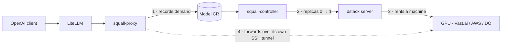

# Squall

**Scale-to-zero LLM serving on GPUs that are not in your cluster.**


Squall gives a Kubernetes cluster access to GPU capacity it does not own. You declare a
`Model` custom resource in Git; squall rents a GPU from an external provider when the first
request arrives, serves OpenAI-compatible traffic from it, and gives the machine back when
the traffic stops. Between requests, there is nothing to pay for.

If you know [KubeAI](https://github.com/kubeai-project/kubeai): **squall is that idea for
capacity that is not in your cluster.** KubeAI scales model Pods to zero on GPU nodes you
already have. Squall scales *machines* to zero, renting them on demand through
[dstack](https://github.com/dstackai/dstack) from Vast.ai, AWS or DigitalOcean. Kubernetes
holds the intent and does the coordinating; no Kubernetes runs on the serving hardware.

Models are reached through [LiteLLM](https://github.com/BerriAI/litellm), which stays
vanilla — squall registers nothing and patches nothing.

## Highlights

**What you get**

🔌 **Zero idle cost** — no request, no machine, no bill
⏱️ **Wake on first request** — the request is held, not rejected, while the GPU comes up
🌍 **Capacity anywhere** — Vast.ai, AWS, DigitalOcean, or an in-cluster Kubernetes backend
📄 **Declared in Git** — a `Model` CR, reconciled like everything else on the platform
🔗 **OpenAI-compatible** — `/v1/chat/completions`, `/v1/completions`, `/v1/models`
🛡️ **Safe by construction** — a wrong wake costs money, a wrong sleep kills a generation, and
every ambiguity is resolved in that direction

**What it is not**

Squall does not schedule Pods onto GPU nodes. If you already have idle GPUs in your cluster,
KubeAI is the better tool and squall buys you nothing. Squall exists for the case where the
hardware does not exist until someone asks for it.

## Why Squall?

### The GPU is not where your cluster is

Plenty of platforms run in a region with no GPU quota, or with GPUs priced so that a
permanently-provisioned instance spends most of its life idle and billed. Squall makes the
GPU a consequence of traffic rather than a standing cost: the `Model` sits at zero replicas
until a request arrives, and returns to zero once the idle window passes with nothing
in flight.

### The data path is squall's, not dstack's

A request reaches a replica one of two ways, and they are not equivalent.

**Direct over SSH (preferred).** `squall-proxy` opens its own SSH connection to the replica
and forwards HTTP inside it. dstack is not in the request path at all.

**Through dstack's service proxy (fallback).** Always available, works on every backend
topology, used automatically whenever the direct path is not.

Measured 2026-08-28 on one RTXPRO6000WS, same prompt and concurrency, minutes apart:

| concurrency | via dstack | direct over SSH |
|---|---|---|
| 32 | 746 tok/s | **1010 tok/s** |
| 128 | 97/128 ok, 31× HTTP 500, 407 tok/s | **128/128 ok, 1857 tok/s** |
| 256 | not attempted | **256/256 ok, 2106 tok/s** |

dstack's proxy exposes its repository and auth as FastAPI `yield` dependencies torn down
only after the response completes, so **every streamed generation pins two database
connections for its entire lifetime**. Its connection pool — not the GPU — is the ceiling.
The 31 failures above coincided exactly with `pg_stat_activity` reaching
`poolSize + maxOverflow + 1`.

The direct path fails soft in every case: no published endpoint, a topology needing more
than one SSH hop, a missing key, a refused dial — each falls through to dstack's proxy.
Turning it on cannot break a request that worked before. See
[docs/operating.md](docs/operating.md) for how it authenticates and how to tell which path a
request took.

### Separate failure domains

Two binaries, deliberately not one:

- **`squall-controller`** — reconciliation only: the 0↔1 replica flip, drain-first teardown
  via finalizer, orphan reconciliation, and status as the shared truth.
- **`squall-proxy`** — the per-request data path: forward when the model is Ready, hold while
  it wakes, and answer the wait contract honestly when the deadline expires.

A crash-looping proxy cannot strand a GPU, and a controller under load cannot drop a request.

## Architecture



1. A request for a sleeping model reaches `squall-proxy`. It records demand on the `Model`
   and **holds the request** rather than failing it.
2. `squall-controller` sees the demand and flips the run to one replica.
3. dstack provisions a machine from whichever backend the `Model` allows, and starts the
   serving engine on it.
4. The held request is retried against the replica as it comes up — the first real request
   *is* the readiness probe. When it succeeds, the caller gets tokens.

When the hold deadline expires before the GPU is ready, the caller gets `503` with
`Retry-After` and a JSON body naming the state (`asleep`, `waking`, `recreating`) — never a
silent hang and never a lie.

Idle works in reverse: once nothing is in flight and the newest request is older than
`scaleDownDelaySeconds`, the run goes to zero replicas; the machine is then released by
dstack — immediately on Vast.ai, Kubernetes and RunPod, or after `fleet.idleDuration` on VM
backends that keep a warm pool. See [Send it a request](#send-it-a-request) for why that
distinction decides your `holdTimeout`.

## Quickstart

### Prerequisites

- A Kubernetes cluster — developed and tested against 1.31 — and Helm 3.8+ (for OCI charts)
- An API key for at least one dstack backend — Vast.ai is the cheapest way to try this
- Squall's images and chart are published to GHCR and are public — both pull anonymously,
  no pull secret needed.

### Install

The chart deploys squall **and a dstack server** — you do not need to run dstack yourself.

```bash
helm install squall oci://ghcr.io/ackstorm/charts/squall --version 0.1.6 \
  --namespace squall-system --create-namespace \
  --set-string dstack.adminToken.value="$(openssl rand -hex 16)" \
  --set controller.env.dstackURL="http://dstack.squall-system.svc.cluster.local:3000"
```

**Upgrading from an earlier version: apply the CRD by hand.** Helm installs `crds/` on
install and *never* upgrades them, so `helm upgrade` alone leaves the Model CRD at whatever
version you first installed — while reporting success. Every field a release adds is missing
until you do this, and `kubectl apply` of a Model using one fails with `unknown field`:

```bash
kubectl apply --server-side -f \
  https://github.com/ackstorm/squall/releases/download/v0.1.6/squall.ackstorm.ai_models.yaml
```

With no `dstack.backends`, dstack provisions onto your own cluster — no GPU, no bill, useful
for trying the lifecycle end to end. The chart discovers the in-cluster SSH jump address;
you do not need to supply a node IP. To rent real hardware, point it at a provider:

```yaml
# values.yaml
dstack:
  credentialsSecretName: vast-credentials   # must contain VAST_API_KEY
  backends:
    - type: vastai
      creds:
        type: api_key
        api_key: ${VAST_API_KEY}
      # Operator policy: the widest infrastructure scope Models may use.
      regions: [es-spain, pt-portugal, fr-france, it-italy, de-germany,
                nl-netherlands, be-belgium, at-austria, ch-switzerland,
                pl-poland, cz-czechia, se-sweden, fi-finland, no-norway]
      # Optional: false excludes individually operated Community Cloud hosts.
      # community_cloud: false
```

`dstack.backends[].regions` is the cluster operator's allow-list. A Model author can
narrow it with `spec.placement.regions`, but cannot widen it: dstack first restricts the
backend catalogue and then applies the Model profile, so the effective set is their
intersection. Vast.ai regions use dstack/gpuhunt's canonical names such as `es-spain`,
not ISO codes such as `ES`.

`community_cloud` also belongs to the Vast.ai backend, not the Model. dstack defaults it
to `true`; setting it to `false` excludes individual operators and may improve the trust
profile at the cost of fewer offers. Both pools are third-party marketplace capacity, so
this switch is not a substitute for a workload security or compliance policy.

Create `vast-credentials` in the chart namespace with a `VAST_API_KEY` key. The chart
imports that Secret as environment variables and replaces `${VAST_API_KEY}` in the
backend config before dstack starts; the credential does not belong in `values.yaml`.

> **Helm never upgrades CRDs.** Files under a chart's `crds/` directory are applied on
> install and ignored on every upgrade. After a version bump, apply the CRD yourself — it
> ships as a release asset:
> ```bash
> kubectl apply --server-side --force-conflicts -f squall.ackstorm.ai_models.yaml
> ```

### Declare a model

```yaml
apiVersion: squall.ackstorm.ai/v1alpha1
kind: Model
metadata:
  name: qwen-tiny
  namespace: squall-system       # any namespace works; this one already exists
spec:
  engine: ollama
  image: ollama/ollama@sha256:c622a7adec67cf5bd7fe1802b7e26aa583a955a54e91d132889301f50c3e0bd0
  model: qwen2.5:0.5b
  features: [TextGeneration]

  minReplicas: 0                 # 0 = sleeps when idle; 1 = always on
  holdTimeout: 10m               # how long a request waits for a cold start
  scaleDownDelaySeconds: 600     # idle window before the run drops to zero replicas
  provisioningTimeout: 20m       # a wake that never becomes Ready is destroyed
  drainTimeout: 30s
  maxLifetime: 4h

  resources:                     # dstack's own selector syntax, passed through verbatim
    cpu:
      count: "2.."               # note: an OBJECT here — unlike the chart's fleet block,
    memory: 8GB..                # which is dstack's flat fleet schema (cpu: "2..")
    gpu:
      memory: 8GB..              # a floor, not a pin: cheapest card that clears it

  placement:
    backends: [vastai]           # only backends named here AND in the chart are eligible
    regions: [es-spain, fr-france, nl-netherlands] # narrower than operator policy
    maxPricePerHour: "0.80"      # quoted — an unquoted float fails CRD validation

  fleet:
    idleDuration: 2m             # how long the machine survives with no run on it —
                                 # but see below: INERT on Vast.ai and Kubernetes

  health:
    unhealthyAfter: 2m           # takes traffic, delivers no 2xx → torn down
    failureThreshold: 3
```

```bash
kubectl apply -f qwen-tiny.yaml
kubectl -n squall-system get models -w
```

Worked examples with measured resource and placement choices are below, and as runnable
files in [config/samples/](config/samples/).

### Send it a request

```bash
kubectl -n squall-system port-forward svc/squall-proxy 8080:8080 &

curl -s localhost:8080/v1/chat/completions \
  -H 'Content-Type: application/json' \
  -d '{"model":"qwen-tiny","messages":[{"role":"user","content":"hello"}]}'
```

The first call blocks while the GPU is provisioned — minutes, on a real backend — and then
answers. Watch it happen:

```bash
kubectl -n squall-system get model qwen-tiny -w   # Asleep → Waking → Ready
kubectl -n squall-system logs -f deploy/squall-proxy
```

Leave it alone and the machine goes away.

**How long that takes depends on the backend, and `fleet.idleDuration` is not always part of
the answer.** dstack only honours an idle window where its internal `dockerized` flag is true.
On **Vast.ai, Kubernetes and RunPod** it is false: dstack forces the window to zero and never
reads your value, so the machine is released on the first pass after the job stops. Measured
on Vast.ai — instance gone **45 seconds** after sleep, against a declared `idleDuration: 30m`.

The consequence is not the teardown, it is the wake. There is **no warm pool** on those
backends, so every wake is a full cold provision and `holdTimeout` has to cover one. Two
rules follow:

- On Vast.ai/Kubernetes/RunPod the warm window is `scaleDownDelaySeconds` **alone**. Squall
  warns when `holdTimeout` exceeds it, and it does the arithmetic per backend.
- On VM backends such as AWS, `fleet.idleDuration` binds and a second wake inside the window
  is fast.

### Point LiteLLM at it

Squall speaks the OpenAI API, so LiteLLM needs no plugin:

```yaml
model_list:
  - model_name: qwen-tiny
    litellm_params:
      model: openai/qwen-tiny
      api_base: http://squall-proxy.squall-system.svc.cluster.local:8080/v1
      api_key: none
```

## Worked examples

Every model here was actually provisioned and served through squall. The numbers are
measured on the run, not estimated from a spec sheet.

| Model | Card | Price/h | First wake | Verified |
|---|---|---|---|---|
| [Qwen3.8-27B-FP8](config/samples/squall_v1alpha1_model.yaml) | 1x RTX PRO 6000 WS, 96GB | $2.003 | 10-15 min | 2026-08-27 |
| [Qwen3-8B](config/samples/squall_v1alpha1_model_qwen3_8b.yaml) | 1x RTX 5090, 32GB | $0.4463 | 9m 53s | 2026-09-04 |
| [GLM-5.3-Flash](config/samples/squall_v1alpha1_model_glm53_flash.yaml) | 4x RTX PRO 6000 | $9.00 cap | not yet run | — |

First wake is dominated by pulling the image and then the weights; a warm request afterwards
is ordinary inference latency. On the Qwen3-8B run: **9m 53s** cold, **0.8s** warm.

### Qwen3.8-27B-FP8 — the flagship, on one card

[`config/samples/squall_v1alpha1_model.yaml`](config/samples/squall_v1alpha1_model.yaml) is a
runnable CR, heavily commented with why each number is what it is. It provisioned an
RTX PRO 6000 WS (96GB) on Vast.ai in `cz-czechia` at **$2.003/h**, served chat, streaming and
vision, then slept and released the instance on its own.

Qwen publish an official FP8 checkpoint, so squall serves that rather than asking vLLM to
quantize at load: 28.8 GiB of weights, which is why the GPU floor is `90GB..` rather than
something tighter — FP8 KV cache at 128k context needs the headroom.

```yaml
spec:
  engine: vllm
  image: vllm/vllm-openai@sha256:2286e8533ca8b6bc777594bae30524f1426ba46ca21797524e06df6a94b06635
  model: Qwen/Qwen3.8-27B-FP8
  args: [--max-model-len, "131072", --kv-cache-dtype, fp8, --reasoning-parser, qwen3]
  resources:
    gpu:
      name: [RTXPRO6000WS, RTXPRO6000S]
      memory: 90GB..
  placement:
    backends: [vastai]
    maxPricePerHour: "2.20"
  holdTimeout: 20m               # must cover a full cold start — no warm pool on Vast
  scaleDownDelaySeconds: 300
```

### Qwen3-8B — the cheap one, for checking the lifecycle costs nothing

[`config/samples/squall_v1alpha1_model_qwen3_8b.yaml`](config/samples/squall_v1alpha1_model_qwen3_8b.yaml),
the same shape at a fifth of the price. Useful when what you want to verify is squall's
behaviour rather than a model's quality: the whole exercise that produced these numbers —
provision, serve, sleep, release — cost **$0.197**.

```yaml
apiVersion: squall.ackstorm.ai/v1alpha1
kind: Model
metadata:
  name: qwen3-8b
  namespace: squall
spec:
  engine: vllm
  image: vllm/vllm-openai@sha256:61fc8a896b0a4fbbbdc063bc4b0dbc25ce98e02b5050c24aeb7830ac02039b14
  model: Qwen/Qwen3-8B
  features: [TextGeneration]
  args: [--max-model-len, "8192", --gpu-memory-utilization, "0.90"]

  resources:
    cpu:
      count: "4.."
    memory: 16GB..
    shmSize: 8GB
    gpu:
      memory: 24GB..             # a floor: an RTX 5090 (32GB) cleared it at $0.4463/h

  placement:
    backends: [vastai]
    maxPricePerHour: "0.80"

  probe:
    path: /health
    interval: 10s
    readyAfter: 2

  minReplicas: 0
  holdTimeout: 20m               # cold start measured at 9m53s — leave room
  scaleDownDelaySeconds: 300
  provisioningTimeout: 30m
  fleet:
    idleDuration: 10m            # inert on Vast.ai; kept for portability to VM backends
```

> **Pin the multi-arch index digest, not a per-architecture one.** A `@sha256:` digest can
> address either an image index or a single-platform leaf, and squall's schema cannot tell
> them apart. Pinning an **arm64** leaf makes dstack require arm64, Vast.ai matches **zero**
> offers, and the failure is reported as `failed_to_start_due_to_no_capacity` — a message
> that sends you tuning CPU, memory and price, none of which can fix it. This cost a whole
> live run. The digest above is the index; get one with
> `docker buildx imagetools inspect <repo>:<tag>` and use its top-level `Digest:`.

### GLM-5.3-Flash — four cards, tensor-parallel

[`config/samples/squall_v1alpha1_model_glm53_flash.yaml`](config/samples/squall_v1alpha1_model_glm53_flash.yaml)
requests `gpu.count: "4"` and 64GB of system RAM, transcribed from the
[rtx6kpro](https://github.com/local-inference-lab/rtx6kpro) field wiki. It is written and
reviewed but has **not** been run end to end — treat its numbers as sourced, not measured.

## Status and limitations

**Pre-alpha, but it serves.** Verified end to end on 2026-08-28 against real Vast.ai GPUs, at
256 concurrent generations with zero failures. What that verification does *not* cover:

- **`squall-proxy` performs no authentication.** Anyone who can reach it can wake capacity and
  spend money. Deploy it on a trusted network, or put an authenticating gateway in front.
  This is the constraint every other limitation assumes.
- **No admission control once a model is Ready.** The proxy forwards unlimited concurrency
  into whatever capacity exists, so per-stream throughput — not squall — is what a caller
  feels under load. Measured: ~1000 tok/s split across ~57 streams is ~17 tok/s each.
- **Marketplace hosts are not data processors.** Internal, non-regulated workloads only.
- **The unhealthy teardown can flap.** A model broken by configuration rather than by machine
  re-wakes on the next request.
- **`spec.hardStop` does not fire on the Kubernetes backend.** It is wired correctly — the
  value reaches dstack's `max_duration` and the runner's submit body — but it is not enforced:
  a job with `max_duration: 2m` was still running at 621s, and one live Model ran 104 minutes
  against a 60-minute limit. Root-caused to dstack wrapping commands in `sh -i -c`, so the
  timeout signals the wrapper shell while the workload is reparented and survives; reported
  upstream as [dstackai/dstack#4259](https://github.com/dstackai/dstack/issues/4259). **Do not
  treat `hardStop` as the bound that survives a dead controller.** Whether VM backends enforce
  it is untested. Ledger D161.

Full list in the [CHANGELOG](CHANGELOG.md); the running engineering ledger is
[docs/references/deviations-and-findings.md](docs/references/deviations-and-findings.md).

## Documentation

| | |
|---|---|
| [docs/operating.md](docs/operating.md) | Running it: the direct SSH path, serving limits, deployment traps |
| [docs/metrics.md](docs/metrics.md) | Prometheus endpoints, metric catalogue and optional ServiceMonitors |
| [docs/specs/](docs/specs/) | The design of record — state machine, wait contract, provider boundary |
| [docs/references/](docs/references/) | Toolchain traps, testing discipline, decisions, the findings ledger |
| [CHANGELOG.md](CHANGELOG.md) | Release notes and known limitations |
| [rtx6kpro](https://github.com/local-inference-lab/rtx6kpro) | Community field wiki for large LLMs on the 96GB Blackwell cards squall rents — model runbooks (GLM-5, Kimi, Qwen), quantization and speculative-decoding measurements behind our samples |

The spec is authoritative. Read it before changing behaviour; every implementation task
references its section numbers.

## Development

**The only thing your host needs is Docker.** No Go toolchain, no kubebuilder, no
controller-gen, no kubectl. Squall targets Go 1.26.6, and pinning that on every developer
machine is not a thing anyone should have to do — so the whole toolchain lives in a container
built from [`Dockerfile.devtools`](Dockerfile.devtools).

```bash
make help                          # every target, self-documenting
make doctor                        # preflight: docker, image, caches, tools. No network.
./scripts/dev.sh go version        # -> go1.26.6
./scripts/dev.sh bash              # interactive shell in the devtools container
```

`make` targets that need the toolchain re-enter the container themselves, so `make test-unit`
and `./scripts/dev.sh make test-unit` are equivalent. Host-only targets (`make doctor`,
`make clean`) deliberately do not.

### Tests

| Target | What it runs |
|---|---|
| `make test-unit` | Pure logic. No envtest, no cluster. |
| `make test-envtest` | Controller against a real API server, race-enabled. The CI gate. |
| `make test-envtest-fast` | Same without `-race`, for the inner loop. Not a CI gate. |
| `make e2e-full` | kind cluster + the ginkgo suite against a fake dstack. |

The envtest Kubernetes assets are pre-baked into the devtools image, so envtest never hits
the network.

### Linux only, by design

`scripts/dev.sh` requires the default Docker socket at `/var/run/docker.sock` and runs the
container with `--network=host`. `DOCKER_HOST=tcp://…`, rootless Docker and Docker Desktop
sockets are unsupported, and the wrapper fails fast with a clear message rather than letting
a downstream `kind` call die cryptically several minutes later.

### Releasing

Push a `v*` tag. [`.github/workflows/release.yml`](.github/workflows/release.yml) runs the
gates, then publishes both images, the Helm chart as an OCI artifact, and a GitHub Release
with the chart tarball, the CRD and checksums.

## Contributing

See [CONTRIBUTING.md](CONTRIBUTING.md) and the [Code of Conduct](CODE_OF_CONDUCT.md).
Security reports: [SECURITY.md](SECURITY.md).

## License

Apache License 2.0 — see [LICENSE](LICENSE) and [NOTICE](NOTICE).
